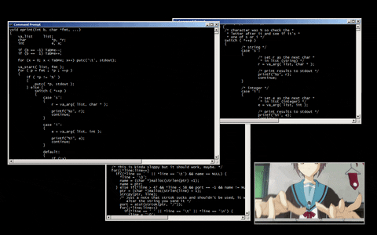

<h1 align="center">Hi 👋 There, I'm Sunny Kumar</h1> 
<h3 align="center">A Passionate Code and Frontend developer from India</h3>

  

<h3 align="left">Connect with me:</h3>

  
  

<h3 align="left">Languages and Tools:</h3>

       

